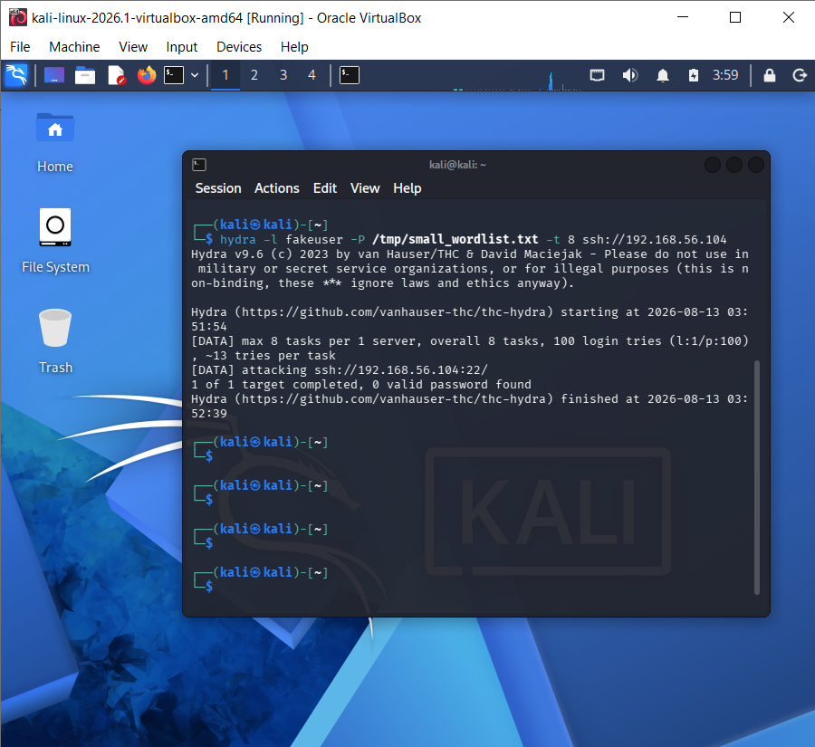

# Drill 1 — Real-Time Triage on a Live Attack

## Summary

| Field | Value |
|---|---|
| **Drill ID** | Drill-001 (Project 4) |
| **Date** | August 13, 2026 |
| **Attack** | Live Hydra SSH brute force (Kali → Ubuntu SOC Agent) |
| **Pipeline Tested** | Full 4-stage: Wazuh → Project 3 → Project 4 → dashboard |
| **Outcome** | Correctly filtered before reaching AI triage — private IP, by design |

---

## What This Drill Tests

Whether the complete cross-project pipeline — real Wazuh detection, Project 3's enrichment engine, and Project 4's AI triage watcher, all running as live independent processes simultaneously — correctly and consistently declines to waste AI API calls on internal/private-IP traffic that never had external threat-intel relevance in the first place.

---

## Execution

Three terminals running concurrently: Project 3's enrichment engine, Project 4's AI triage watcher, and a real Hydra attack from Kali against the Ubuntu SOC Agent (same technique validated across Projects 2 and 3).

```bash
hydra -l fakeuser -P /tmp/small_wordlist.txt -t 8 ssh://192.168.56.104
```


Rule 100011 fired correctly (confirmed via Wazuh alerts). Project 3's engine picked it up within 3 seconds:

```
2026-08-13 07:42:28,056  INFO  Skipping private IP: 192.168.56.50 (rule 100011)
```

---

## Why Nothing Reached Project 4

Since Kali's IP (`192.168.56.50`) is private/RFC1918, Project 3's engine correctly skips external enrichment for it — same finding as Project 3's own Drill 1. Critically, a **skipped** alert never gets written to `enrichment_alerts.json` at all, meaning Project 4's watcher — which only reads that file — never even sees this alert. There was nothing to triage, and nothing should have been triaged.

This is the correct end-to-end behaviour of the decoupled architecture: filtering happens once, upstream, at Project 3's layer, and Project 4 correctly never spends an API call on data that was never going to be meaningful.

---

## Verdict

| Field | Value |
|---|---|
| Wazuh Detection | True Positive — Rule 100011 fired correctly |
| Project 3 Enrichment | Correctly skipped (private IP) |
| Project 4 AI Triage | Correctly never invoked (no data reached it) |
| Pipeline Behaviour | Working exactly as designed across all 3 layers |

---

## Simulation Context

Real live attack, real Wazuh detection, real running processes for both Project 3 and Project 4 simultaneously. No data was fabricated. The "non-event" at Project 4's layer is itself the intended, correct finding — consistent with the same architectural constraint documented in Project 3's own Drill 1.
