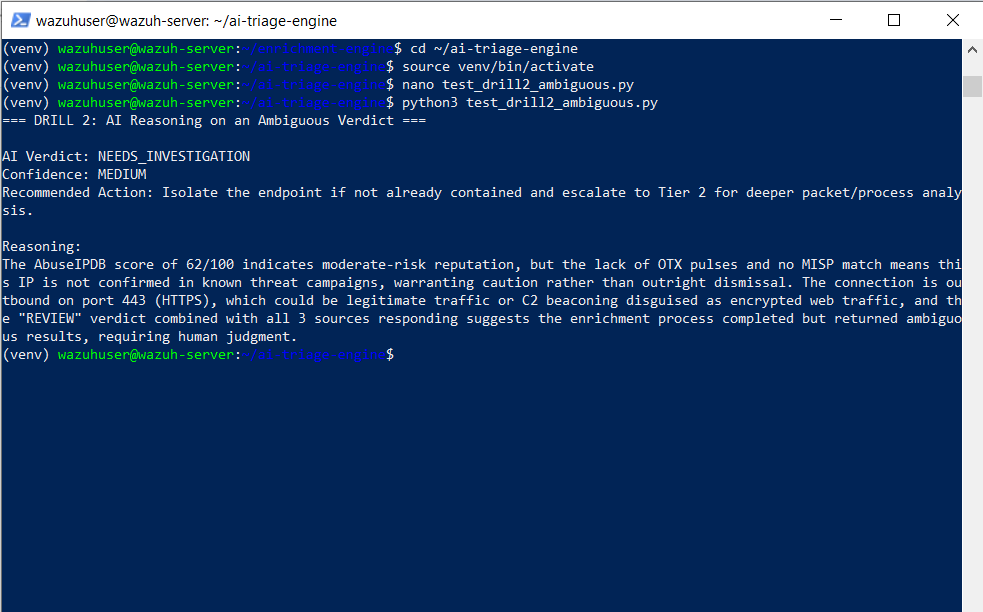

# Drill 2 — AI Catches What a Rule-Only System Would Miss

## Summary

| Field | Value |
|---|---|
| **Drill ID** | Drill-002 (Project 4) |
| **Date** | August 13, 2026 |
| **Scenario** | Ambiguous threat intel verdict (REVIEW tier) |
| **AI Verdict** | NEEDS_INVESTIGATION (MEDIUM confidence) |
| **Outcome** | AI's reasoning adds genuine analytical value beyond the raw verdict label |

---

## What This Drill Tests

Whether the AI's *reasoning* — not just its verdict classification — provides value a rule-only system cannot. A dashboard showing `REVIEW` tells an analyst "look at this." Does the AI explain *what specifically* to look at and *why*?

---

## Constructed Scenario

A deliberately constructed enrichment result representing a genuinely mixed signal: moderate AbuseIPDB confidence, zero corroboration from other sources — the same pattern as ground-truth case `fresh-004` from Phase D.

```python
ambiguous_enrichment = {
    "verdict": "REVIEW",
    "sources_responding": 3,
    "summary": {
        "abuse_score": 62,
        "otx_pulses": 0,
        "misp_matched": False
    }
}
```

---

## AI Response

```
AI Verdict: NEEDS_INVESTIGATION
Confidence: MEDIUM
Recommended Action: Isolate the endpoint if not already contained and
    escalate to Tier 2 for deeper packet/process analysis.

Reasoning: The AbuseIPDB score of 62/100 indicates moderate-risk
reputation, but the lack of OTX pulses and no MISP match means this
IP is not confirmed in known threat campaigns, warranting caution
rather than outright dismissal. The connection is outbound on port
443 (HTTPS), which could be legitimate traffic or C2 beaconing
disguised as encrypted web traffic, and the "REVIEW" verdict combined
with all 3 sources responding suggests the enrichment process
completed but returned ambiguous results, requiring human judgment.
```

---

## What This Demonstrates

The AI's reasoning contributed three things a raw `REVIEW` label alone does not:

1. **Separated "moderate reputation" from "confirmed campaign attribution"** — explicitly distinguishing a 62/100 score without corroboration from a confirmed threat, a more precise read than the label alone provides.
2. **Reasoned about port/protocol context** — flagging that port 443 outbound traffic could be legitimate HTTPS or disguised C2 beaconing, genuine security reasoning rather than a templated response.
3. **Correctly interpreted "3 sources responding" as meaningful** — recognising this as enrichment *succeeding* and landing in a genuine gray zone, distinct from the "0 sources responding" (skipped enrichment) case addressed by the Phase D prompt fix.

---

## Verdict

| Field | Value |
|---|---|
| AI Verdict | NEEDS_INVESTIGATION |
| Confidence | MEDIUM |
| Value-add demonstrated | Yes — reasoning surfaces specific, actionable context beyond the verdict label |

---

## Simulation Context

Labelled, deliberately constructed enrichment data representing a realistic ambiguous-score scenario (moderate AbuseIPDB confidence, no OTX/MISP corroboration) — the same category as ground-truth case `fresh-004`. Constructed rather than pulled from a live lookup specifically to guarantee a genuinely ambiguous result for this demonstration, since live AbuseIPDB scores fluctuate daily and cannot be reliably targeted to a specific range on demand.
