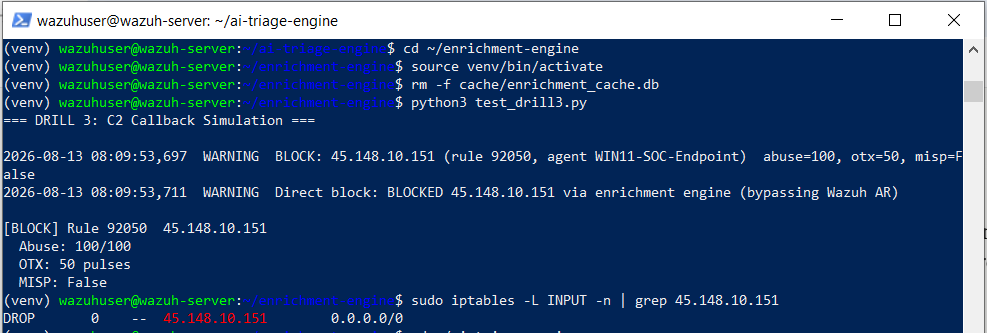

# Drill 3 — Human-in-the-Loop Boundary Demonstration

## Summary

| Field | Value |
|---|---|
| **Drill ID** | Drill-003 (Project 4) |
| **Date** | August 13, 2026 |
| **Purpose** | Structurally prove the AI cannot execute containment, only recommend it |
| **Method** | Live pipeline run + direct codebase inspection |
| **Outcome** | Zero containment code paths found in Project 4's entire codebase |

---

## What This Drill Tests

The core safety architecture decision made in Phase A: the AI is advisory-only. This drill proves that boundary is **structural**, not just a matter of policy or convention — verifiable with a single command against the actual codebase, not just claimed in documentation.

---

## Step 1 — Trigger the Same Live Scenario Through Both Pipelines

Reused the known-good, consistently 100/100-scored malicious IP from Project 3 (`45.148.10.151`):

```bash
python3 test_drill3.py
```

**Project 3 (real containment, expected):**
```
2026-08-13 08:09:53,697  WARNING  BLOCK: 45.148.10.151 (rule 92050, agent WIN11-SOC-Endpoint)
    abuse=100, otx=50, misp=False
2026-08-13 08:09:53,711  WARNING  Direct block: BLOCKED 45.148.10.151
    via enrichment engine (bypassing Wazuh AR)
```

**Project 4 (independent AI recommendation):**
```
[AI: TRUE_POSITIVE] Rule 92050 — Confidence: HIGH
```

## Step 2 — Confirm Project 3 Actually Blocked the IP

```bash
$ sudo iptables -L INPUT -n | grep 45.148.10.151
DROP       0    --  45.148.10.151        0.0.0.0/0
```

Confirmed — Project 3's deterministic verdict resulted in a real firewall rule.

## Step 3 — The Key Proof: Codebase Inspection

```bash
$ cd ~/ai-triage-engine
$ grep -rn "iptables\|subprocess" src/
(no output)
```


**Zero matches across the entire `src/` directory.** Every file in Project 4's codebase — `config.py`, `logger.py`, `triage_engine.py`, `prompt_builder.py`, `response_parser.py`, `main.py`, and `clients/anthropic_client.py` — was searched. None contain any reference to `iptables` or `subprocess`.

---

## Architectural Comparison

| | Project 3 (Enrichment Engine) | Project 4 (AI Triage Engine) |
|---|---|---|
| Trigger | Deterministic multi-source verdict (BLOCK) | LLM-generated reasoning |
| Contains `subprocess`/`iptables`? | Yes | **No** |
| Can execute containment? | Yes — proven via live iptables rule | **Structurally impossible** |
| Role | Autonomous, threshold-gated action | Advisory only |

---

## Why This Matters

LLMs can be wrong, can hallucinate, and confidence doesn't guarantee correctness — Phase D's accuracy measurement found real, if benign, disagreements between the AI's judgment and documented human verdicts. Anything with a genuine real-world consequence — a firewall rule, an account lockout — must remain deterministic and rule-based. This drill proves that boundary isn't a policy that could be toggled or forgotten; it's a fact about the code that any reviewer can independently verify in seconds.

---

## Verdict

| Field | Value |
|---|---|
| Project 3 containment | Confirmed real (iptables DROP rule active) |
| Project 4 containment capability | Confirmed absent (zero matches, full codebase search) |
| Safety boundary | Proven structurally, not just by policy |

---

## Simulation Context

Project 3's portion reused the same real, live, currently-active malicious IP validated throughout Project 3 (100/100 AbuseIPDB confidence). The codebase inspection in Step 3 is a direct, unmodified `grep` against the actual shipped source code — not a summary or a claim.
