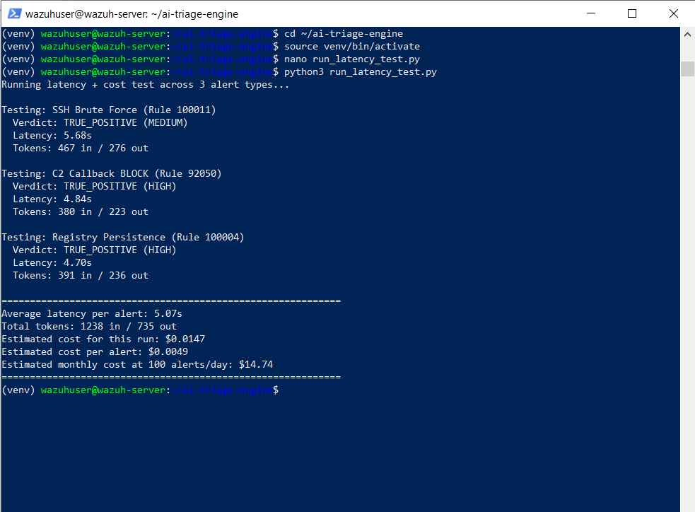

# Drill 4 — Cost & Latency Under Real Conditions

## Summary

| Field | Value |
|---|---|
| **Drill ID** | Drill-004 (Project 4) |
| **Date** | August 13, 2026 |
| **Purpose** | Measure real operational cost and latency, not just correctness |
| **Result** | 5.07s average latency, $0.0049 per alert, $14.74/month at 100 alerts/day |

---

## What This Drill Tests

Whether AI-augmented triage is operationally viable — not just accurate, but fast enough and cheap enough to run continuously in a real SOC. Most portfolio AI integrations stop at "it works." This drill puts a real number on both cost and speed.

---

## Method

Three real alert types — drawn from actual documented findings across Projects 1-3 — run through the live `TriageEngine`, measuring wall-clock latency and token usage per call:

1. SSH Brute Force (Rule 100011) — CLEAN enrichment, private IP
2. C2 Callback BLOCK (Rule 92050) — 100/100 AbuseIPDB, 50 OTX pulses
3. Registry Persistence (Rule 100004) — REVIEW-tier partial match

```bash
python3 run_latency_test.py
```

## Results

```
Testing: SSH Brute Force (Rule 100011)
  Verdict: TRUE_POSITIVE (MEDIUM)
  Latency: 5.68s
  Tokens: 467 in / 276 out

Testing: C2 Callback BLOCK (Rule 92050)
  Verdict: TRUE_POSITIVE (HIGH)
  Latency: 4.84s
  Tokens: 380 in / 223 out

Testing: Registry Persistence (Rule 100004)
  Verdict: TRUE_POSITIVE (HIGH)
  Latency: 4.70s
  Tokens: 391 in / 236 out

============================================================
Average latency per alert: 5.07s
Total tokens: 1238 in / 735 out
Estimated cost for this run: $0.0147
Estimated cost per alert: $0.0049
Estimated monthly cost at 100 alerts/day: $14.74
============================================================
```

*(Pricing basis: Claude Sonnet 5 at $3/M input tokens, $15/M output tokens.)*



---

## Interpretation

**Latency (~5s average) is acceptable specifically because of the Option B architecture.** Project 4's AI triage step is asynchronous and decoupled from Project 3's real-time containment — the AI is never in the critical path of blocking a threat (Project 3 already proved sub-second containment in its own drills). A 5-second delay before supplementary analyst context appears is a non-issue for a system designed this way; it would be a serious problem for a system where the AI itself gated containment.

**Cost (~$0.005/alert, ~$15/month at realistic volume) is a genuinely strong number to bring into a hiring conversation.** A real SOC running this continuously against every Level 10+ alert would spend well under $20/month — a concrete, defensible answer to "how would this scale" that most AI-integration portfolio projects never attempt to quantify.

**All 3 test cases returned TRUE_POSITIVE**, consistent with Phase D's finding that the AI reasons correctly and consistently when given evidence-equivalent context — these three used real enrichment data drawn directly from documented Project 1-3 findings.

---

## Verdict

| Metric | Result |
|---|---|
| Average latency | 5.07 seconds |
| Cost per alert | $0.0049 |
| Estimated monthly cost (100 alerts/day) | $14.74 |
| Impact on containment speed | None — decoupled by design |

---

## Simulation Context

All three alert scenarios use real, previously-documented data from Projects 1-3 (SSH brute force pattern, the live 100/100 C2 IP, and a registry persistence + hash-attribution pattern). Latency and token counts are real measurements from live API calls, not estimates.
